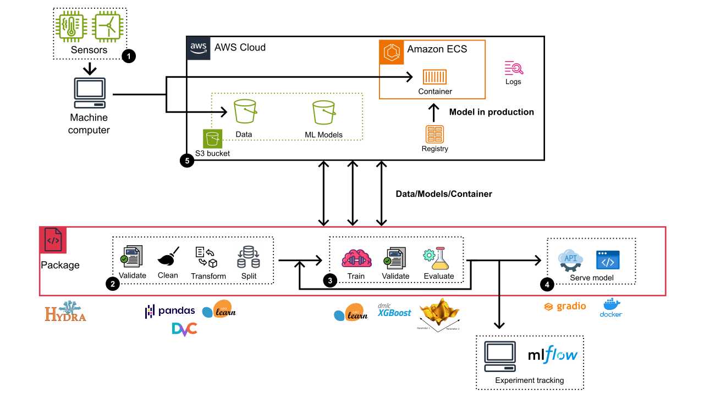

# Industrial MLops: Machine-learning fault Detection for Electromechanical Machines

## Overview
This end-to-end MLops project showcases the development and implementation of a boosting-based machine learning algorithm tailored for fault detection in electromechanical machines. The results from out-of-sample evaluation demonstrate the system's ability to detect 78% of potentially faulty machines with 98% accuracy rate. The repository encompasses the complete source code required for prediction tasks, real-time monitoring of prediction scores, and model retraining when needed. For optimal model performance, hyperparameter tuning is skillfully executed using Bayesian optimization techniques. Moreover, the project include an integrated application that offers both a user-friendly interface and an API for seamless model deployment and utilization.

## Architecture

### Details
1. **Obtaining and uploading sensor data**: External processes handle data collection and upload.
2. **Preprocessing pipeline**:  Utilizing a scikit-learn pipeline, data undergoes preprocessing involving pydantic validation and transformation. This includes cleaning, imputation, standardization and decoding Using proprietary functions based on the scikit-learn Baseline class. The pipeline generates separate training and evaluation sets, with all data versioned using DVC and stored in an Amazon S3 bucket.
3. **Model training and evaluation**: The project employs an extreme gradient boosting (XGboost) classification algorithm. Hyperparameter tuning is achieved through Bayesian optimization via the hyperopt utility. Model training and evaluation involve cross-validation and out-of-sample data assessment. Experiment outcomes are persisted in mlflow for comprehensive monitoring.
4. **Model deployment**: The model is served by an API and a web application, both based on gradio. The application is containerized with docker and uploaded to amazon container registry.
5. **ML app in production**: mazon Elastic Container Service (ECS) powers the production deployment of the ML app. The ECS setup includes all necessary functions and libraries for the execution of each model step.

## Instructions
*To use this project, you can follow these steps*:
- **Environment Setup**: Create and activate a virtual environment, then install the required packages using `requirements.txt`. You can use the `create_environment` command too (`Makefile` interperter required)
- **Data Preparation**: Ensure the necessary data files are available in the `data/raw` directory. These are the original, immutable data files that will serve as the input for your machine learning pipeline
- **Configuration**: Modify the `config/config.yaml` file to adjust hyperparameters and other settings as needed for your experiments
- **Model Training**: Train your machine learning model using the provided scripts in the `src/models` directory. For instance, to train the model, run the `makefile` command `train_model` or the bash command: `python -m src.models.train_model`
- **Visualization**: Evaluation charts are generated automatically after training in `reports/figures/`
- **Model Prediction**: Use the `predict_model` or the `test_prediction` function for standalone predictions or model evaluation accordingly
- **App Deployment**: Deploy the model through the provided Gradio app located in the app/src directory. Follow these steps:
    - Build the Docker container for the app from the `./app` folder: `cd app` and `docker build -t` <app-name> .
    - Run the Docker container: `docker run -p <host-port>:<container-port> <app-name>`

## Project Organization

    ├── LICENSE
    ├── Makefile            <- Makefile with commands like `train_model` or `test_environment`
    ├── README.md           <- The top-level README for developers using this project.
    ├── data
    │   ├── interim         <- Intermediate data that has been transformed.
    │   └── raw             <- The original, immutable data dump.
    │
    ├── models              <- Trained and serialized models.
    |   └── XGBoost.joblib
    │
    ├── config
    │    └── config.yaml    <- Yaml for configuring the package (Hyperparamters can be 
    │                          modified here)
    │
    ├── notebooks           <- Jupyter notebooks. (EDA, research and Bayesian optimization)
    │
    ├── reports             <- Generated analysis.
    │   └── figures         <- Generated graphics with evaluation curves and confusion matrix
    │
    ├── requirements.txt    <- The requirements file for reproducing the environment.
    │
    ├── setup.py            <- makes project pip installable (pip install -e .) so src can be imported
    ├── src                 <- Source code for use in this project.
    │   ├── __init__.py     <- Makes src a Python module
    │   │
    │   ├── models          <- Scripts to train models and then use trained models to make predictions              
    │   │   ├── predict_model.py
    │   │   ├── train_model.py
    │   │   ├── preprocessors.py
    │   │   └── pipeline.py
    │   │
    │   └── visualization   <- Scripts to create results oriented visualizations
    │       └── visualize.py
    |
    └── app                     <- Gradio app (user interface and API)
        ├── Dockerfile          <- Instruction to build the container
        ├── requirements.txt    <- Requirements for the app
        └── src                 <- Soruce code
            ├── main.py 
            └── models  
## Note
The exploratory data analysis procedure, model evaluation and pipeline design can be found in the `notebooks` folder. Soon they will be edited to detail each procedure and contribute to the kaggle community.

